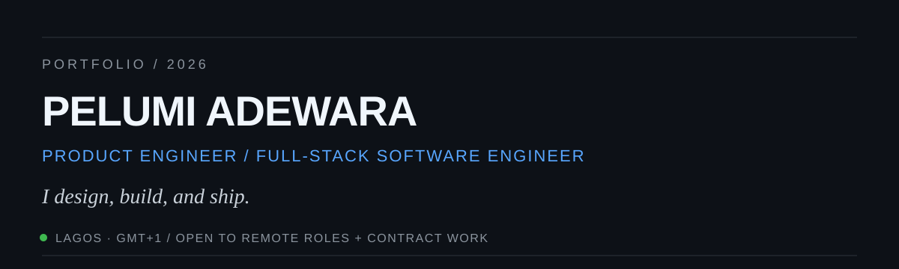

 

## What I do

I'm a **Product Engineer and Full-Stack Software Engineer** with 5+ years of practice building production web and mobile products across **fintech, automotive, marketplaces, real estate, and education**.

I work across the product stack — from interface design and frontend architecture to APIs, authentication, databases, integrations, and deployment.

**Currently:** Full-stack engineer at **QWAM Technologies / QwamPay** and **Motoka**.

---

## Selected work

### 01 — QwamPay
**FINTECH · FRONTEND · BACKEND · PRODUCT UI**

Production surfaces for a WhatsApp-native payments platform: marketing, support, admin, reusable UI infrastructure, and backend work behind WhatsApp payment flows and Meta Business messaging.

`React` `TypeScript` `Tailwind CSS` `Node.js`

[Live product →](https://qwampay.com) · [QWAM Technologies →](https://www.qwamtechnologies.com)

### 02 — Motoka
**AUTOMOTIVE · BACKEND · API DESIGN · DATABASE**

Backend architecture for a vehicle-documents platform serving around 5,000 registered car owners — auth, 2FA, KYC, vehicle records, payments, uploads, REST APIs, and automated expiry reminders.

`Node.js` `Express` `PostgreSQL` `Supabase` `REST`

[Live product →](https://motoka.ng) · [Backend repository →](https://github.com/Dave1604/motoka-backend)

### 03 — Ronsho
**MARKETPLACE · FULL-STACK · SOLO BUILD**

A Nigerian bespoke-fashion marketplace connecting customers with tailors and fabric sellers, with discovery, profiles, fabrics, search, fitting requests, and bookings.

`React` `TypeScript` `Vite` `Tailwind` `Node.js` `Supabase`

[Repository →](https://github.com/Dave1604/ronsho)

### 04 — Study Buddy
**EDUCATION · FULL-STACK · RESEARCH**

A dissertation-grade e-learning platform built around evidence-based learning features: in-lesson quizzes, explanatory feedback, progress tracking, and honest course-duration estimates.

`React` `Node.js` `Express` `Supabase / PostgreSQL` `Recharts`

[Repository →](https://github.com/Dave1604/study-buddy-platform)

---

## Working set

**Interface**  
`React` · `Next.js` · `TypeScript` · `Tailwind CSS` · `Framer Motion`

**Backend**  
`Node.js` · `Express` · `REST APIs` · `Authentication` · `2FA` · `KYC`

**Data**  
`PostgreSQL` · `Supabase` · `MongoDB`

**Mobile & Product**  
`React Native` · `Figma` · `Design Systems` · `Prototyping`

---

## How I build

- **Design and code belong in the same conversation.** I move between product thinking, Figma, and implementation.
- **Performance is a product decision.** Speed, payload, image weight, and first paint are part of the experience.
- **Interfaces should feel honest.** Loading states, errors, and labels should tell users exactly what is happening.
- **Build small, ship often.** I prefer useful production increments over oversized launches.
- **Accessibility is the floor, not the finish.** Semantic structure, focus order, contrast, and motion preferences matter.

---

## GitHub

---

### Building something worth shipping?

I'm open to **full-time remote roles** and **contract product work**.

[Portfolio](https://pelumi-adewara.vercel.app) ·
[LinkedIn](https://www.linkedin.com/in/pelumi-adewara) ·
[Email](mailto:Padewara12@gmail.com)

Lagos, Nigeria · GMT+1 · UK/EU full-day overlap · US East Coast morning overlap

